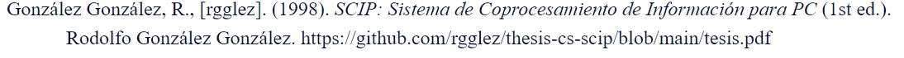

# SCIP

[![CC BY-NC-ND 4.0][cc-by-nc-nd-shield]][cc-by-nc-nd]


My Computer Science Bachelor's Degree Thesis. A general-pourpose programable co-processor card for PC, based on the Intel 8088.

## Citation

If you want to cite some part of my work, please use the following APA style reference list entry:

<blockquote>
González González, R., [rgglez]. (1998). SCIP: Sistema de Coprocesamiento de Información para PC (1st ed.). Rodolfo González González. https://github.com/rgglez/thesis-cs-scip/blob/main/tesis.pdf
</blockquote>



```latex
@book{gonzalez1998scip,
  author    = {González González, Rodolfo},
  title     = {SCIP: Sistema de Coprocesamiento de Información para PC},
  year      = {1998},
  edition   = {1},
  publisher = {Rodolfo González González},
  note      = {[rgglez]},
  url       = {https://github.com/rgglez/thesis-cs-scip/blob/main/tesis.pdf}
}
```

## License

Copyright 1998, Rodolfo González González.

This work is licensed under a
[Creative Commons Attribution-NonCommercial-NoDerivs 4.0 International License][cc-by-nc-nd].

[![CC BY-NC-ND 4.0][cc-by-nc-nd-image]][cc-by-nc-nd]

[cc-by-nc-nd]: http://creativecommons.org/licenses/by-nc-nd/4.0/
[cc-by-nc-nd-image]: https://licensebuttons.net/l/by-nc-nd/4.0/88x31.png
[cc-by-nc-nd-shield]: https://img.shields.io/badge/License-CC%20BY--NC--ND%204.0-lightgrey.svg

Read the [LICENSE](LICENSE.txt) file.
